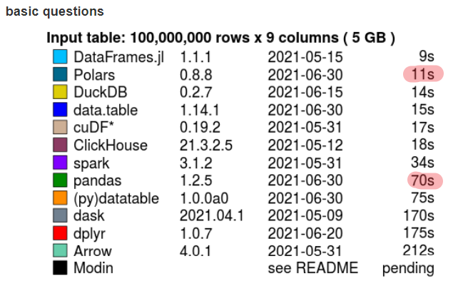

Data taken from [kaggle](https://www.kaggle.com/devinanzelmo/dota-2-matches)

---

# Polars

## About Polars

- Written in Rust (-> Fast and memory efficient)
- Relies on Arrow for Memory Mapping and column oriented data storage and access
- Offers a Python wrapper (pip installable, everything can be done in python)
- Easy to get started and use (does not require additional components like PySpark or Dask do)
- Multi-threaded compared to single-threaded numpy and pandas (Dask attempts to parallelize single threaded operations)
- (Semi-) Lazy execution
- Query optimizations (e.g. predicate pushdown, projection pushdown, …)
- Operations run in parallelizable contexts -> each column operation runs in parallel
- Proper NaN dtypes (unlike pandas where pd.NA is float)
- Distributes the work locally. For very big datasets this might be a limitation

=> Runs 5x-20x faster than pandas at 50%-75% lower memory consumption

</br>

---

</br>

## Benchmark

[H2O Database-like ops benchmark](https://h2oai.github.io/db-benchmark/)

### Join
<!--  -->


### Groupby



## Data

Dota 2 [Datensatz](https://www.kaggle.com/devinanzelmo/dota-2-matches) von Kaggle im format `.csv`

### Tables used

- `match.csv` (2.6MB) - Information about the played matches (50K matches)

```python
       match_id  start_time  duration  tower_status_radiant   ...
0             0  1446750112      2375                  1982   ...
1             1  1446753078      2582                     0   ...
2             2  1446764586      2716                   256   ...
3             3  1446765723      3085                     4   ...
```

- `cluster_regions.csv` (1KB) - Information about the clusters (geographic regions)

```python
    cluster                region
0       111               US WEST
1       112               US WEST
2       113               US WEST
3       121               US EAST
```

- `purchase_log.csv` (289.8MB) - Informations about bought items (~18Mio transactions)

```python
┌─────────┬──────┬─────────────┬──────────┐
│ item_id ┆ time ┆ player_slot ┆ match_id │
│ ---     ┆ ---  ┆ ---         ┆ ---      │
│ i64     ┆ i64  ┆ i64         ┆ i64      │
╞═════════╪══════╪═════════════╪══════════╡
│ 44      ┆ -81  ┆ 0           ┆ 0        │
├╌╌╌╌╌╌╌╌╌┼╌╌╌╌╌╌┼╌╌╌╌╌╌╌╌╌╌╌╌╌┼╌╌╌╌╌╌╌╌╌╌┤
│ 29      ┆ -63  ┆ 0           ┆ 0        │
├╌╌╌╌╌╌╌╌╌┼╌╌╌╌╌╌┼╌╌╌╌╌╌╌╌╌╌╌╌╌┼╌╌╌╌╌╌╌╌╌╌┤
│ 43      ┆ 6    ┆ 0           ┆ 0        │
└─────────┴──────┴─────────────┴──────────┘
```

- `item_ids.csv` (3KB) - Informations about item names and mappings

```python
     item_id         item_name
0          1             blink
1          2  blades_of_attack
2          3        broadsword
3          4         chainmail
```

- `players.csv` (126.9MB) - Informations about the players (500K entries, 10 for each match)

```python
        match_id  account_id  hero_id  player_slot  gold  gold_spent   ...
0              0           0       86            0  3261       10960   ...
1              0           1       51            1  2954       17760   ...
2              0           0       83            2   110       12195   ...
3              0           2       11            3  1179       22505   ...
```

*Note: Anonymous users have the value of 0 for account_id*

## Operations

Compare polars and pandas using a set of typical operations (read data, join, groupby, filter, select, ...)

```python
# API in some cases equal/similar to pandas
pl_match = pl.read_csv(f"{DATA_DIR}/match.csv")

match_with_region = pl_match.join(pl_cluster_regions, how="left", on="cluster").drop(
    "cluster"
)
```

```python
# Polars
purchases_with_item_names = (
    pl_purchase_log.join(pl_item_id_names, how="left", on="item_id")
    .drop("item_id")
    .groupby(["match_id", "player_slot", "item_name"])
    .agg(pl.col("time").list().keep_name())  # In other cases close to pyspark
)
```

```python
# Pandas
purchases_with_item_names = (
    pd.merge(pd_purchase_log, pd_item_id_names, how="left", on="item_id")
    .drop(columns="item_id")
    .groupby(["match_id", "player_slot", "item_name"])["time"]
    .apply(list)
    .reset_index()
)

```

</br>
</br>
</br>

---

</br>
</br>
</br>

## Results and performance

### Pandas CPU / Memory usage


### Polars CPU / Memory usage


## Code execution time

<div style="display: grid; grid-template-areas: 'a b' 'c d';">
  <h3 style="grid-area: a;">Pandas execution time (10% of the data)</h3>
  

  <h3 style="grid-area: b;">Polars execution time (100% of the data)</h3>
  
</div>

## Query plan

<div style="display: grid;">
  
  </br>
  <p>σ -> predicate pushdown (filter etc. on scan level)</p>
  <p>π -> projection pushdown (column selection on scan level)</p>
  <p>aggregate pushdown (aggregations on scan level)</p>
  
</div>

## Lazy evaluation and fetch

```python
# fetch takes a number of rows from the initial files and run the code 

# Example: 18Mio entries in the largest file 'purchase_log' 
# -> 100 Mio limit fetches all data
# -> 1 Mio limit fetches a fraction of the data

pl_final_fetch = pl_final_lazy.fetch(n_rows=int(1_000_000))
pl_final_fetch.shape
>>> (15305, 86)
```

## More about polars

```python
df
┌──────┬───────┬──────────┬──────────┬────────┐
│ nrs  ┆ names ┆ random   ┆ random2  ┆ groups │
│ ---  ┆ ---   ┆ ---      ┆ ---      ┆ ---    │
│ i64  ┆ str   ┆ f64      ┆ f64      ┆ str    │
╞══════╪═══════╪══════════╪══════════╪════════╡
│ 1    ┆ foo   ┆ 0.154163 ┆ 0.900715 ┆ A      │
├╌╌╌╌╌╌┼╌╌╌╌╌╌╌┼╌╌╌╌╌╌╌╌╌╌┼╌╌╌╌╌╌╌╌╌╌┼╌╌╌╌╌╌╌╌┤
│ 2    ┆ ham   ┆ 0.74     ┆ 0.033421 ┆ A      │
├╌╌╌╌╌╌┼╌╌╌╌╌╌╌┼╌╌╌╌╌╌╌╌╌╌┼╌╌╌╌╌╌╌╌╌╌┼╌╌╌╌╌╌╌╌┤
│ 3    ┆ spam  ┆ 0.263315 ┆ 0.956949 ┆ B      │
├╌╌╌╌╌╌┼╌╌╌╌╌╌╌┼╌╌╌╌╌╌╌╌╌╌┼╌╌╌╌╌╌╌╌╌╌┼╌╌╌╌╌╌╌╌┤
│ null ┆ foo   ┆ 0.533739 ┆ 0.137209 ┆ C      │
├╌╌╌╌╌╌┼╌╌╌╌╌╌╌┼╌╌╌╌╌╌╌╌╌╌┼╌╌╌╌╌╌╌╌╌╌┼╌╌╌╌╌╌╌╌┤
│ 5    ┆ foo   ┆ 0.014575 ┆ 0.283828 ┆ A      │
├╌╌╌╌╌╌┼╌╌╌╌╌╌╌┼╌╌╌╌╌╌╌╌╌╌┼╌╌╌╌╌╌╌╌╌╌┼╌╌╌╌╌╌╌╌┤
│ 6    ┆ spam  ┆ 0.918747 ┆ 0.606083 ┆ A      │
└──────┴───────┴──────────┴──────────┴────────┘
```

### Basic operations

```python
df[
    [
        pl.col("random").count().alias("count_method"),
        pl.count("random").alias("count_function"),
    ]
]

┌──────────────┬────────────────┐
│ count_method ┆ count_function │
│ ---          ┆ ---            │
│ u32          ┆ u32            │
╞══════════════╪════════════════╡
│ 6            ┆ 6              │
└──────────────┴────────────────┘
```

### Selecting columns

Polars expressions such as sum() can be used in three different contexts.

- selection: df.select([..])
- groupby / aggregation: df.groupby(..).agg([..])
- hstack / add columns: df.with_columns([..])

```python
# in any case there are multiple ways to select columns
df[
    [
        pl.sum("random").alias("sum_function"),
        pl.sum(pl.Float64),
        # pl.sum("^random.*$")
        # pl.all().exclude(["nrs", "names", "groups"]).sum()
    ]
]

┌──────────────┬──────────┬──────────┐
│ sum_function ┆ random   ┆ random2  │
│ ---          ┆ ---      ┆ ---      │
│ f64          ┆ f64      ┆ f64      │
╞══════════════╪══════════╪══════════╡
│ 2.624589     ┆ 2.624589 ┆ 2.918206 │
└──────────────┴──────────┴──────────┘
```

### conditional operations

```python
df.select(
    [
        pl.when(pl.col("random") > 0.5)
        .then(0)
        .otherwise(pl.col("random") * pl.sum("nrs"))
        .alias("binary_function")
    ]
)

┌─────────────────┐
│ binary_function │
│ ---             │
│ f64             │
╞═════════════════╡
│ 2.620768        │
├╌╌╌╌╌╌╌╌╌╌╌╌╌╌╌╌╌┤
│ 0.0             │
├╌╌╌╌╌╌╌╌╌╌╌╌╌╌╌╌╌┤
│ 4.476355        │
├╌╌╌╌╌╌╌╌╌╌╌╌╌╌╌╌╌┤
│ 0.0             │
├╌╌╌╌╌╌╌╌╌╌╌╌╌╌╌╌╌┤
│ 0.247774        │
├╌╌╌╌╌╌╌╌╌╌╌╌╌╌╌╌╌┤
│ 0.0             │
└─────────────────┘
```

```python
df.select(
    [
        pl.all(),
        pl.when(pl.col("names") == "foo")
        .then("cat_1")
        .when(pl.col("names") == "spam")
        .then("cat_2")
        .otherwise("other")
        .alias("name_category"),
    ]
)

┌──────┬───────┬──────────┬──────────┬────────┬───────────────┐
│ nrs  ┆ names ┆ random   ┆ random2  ┆ groups ┆ name_category │
│ ---  ┆ ---   ┆ ---      ┆ ---      ┆ ---    ┆ ---           │
│ i64  ┆ str   ┆ f64      ┆ f64      ┆ str    ┆ str           │
╞══════╪═══════╪══════════╪══════════╪════════╪═══════════════╡
│ 1    ┆ foo   ┆ 0.154163 ┆ 0.900715 ┆ A      ┆ cat_1         │
├╌╌╌╌╌╌┼╌╌╌╌╌╌╌┼╌╌╌╌╌╌╌╌╌╌┼╌╌╌╌╌╌╌╌╌╌┼╌╌╌╌╌╌╌╌┼╌╌╌╌╌╌╌╌╌╌╌╌╌╌╌┤
│ 2    ┆ ham   ┆ 0.74     ┆ 0.033421 ┆ A      ┆ other         │
├╌╌╌╌╌╌┼╌╌╌╌╌╌╌┼╌╌╌╌╌╌╌╌╌╌┼╌╌╌╌╌╌╌╌╌╌┼╌╌╌╌╌╌╌╌┼╌╌╌╌╌╌╌╌╌╌╌╌╌╌╌┤
│ 3    ┆ spam  ┆ 0.263315 ┆ 0.956949 ┆ B      ┆ cat_2         │
├╌╌╌╌╌╌┼╌╌╌╌╌╌╌┼╌╌╌╌╌╌╌╌╌╌┼╌╌╌╌╌╌╌╌╌╌┼╌╌╌╌╌╌╌╌┼╌╌╌╌╌╌╌╌╌╌╌╌╌╌╌┤
│ null ┆ foo   ┆ 0.533739 ┆ 0.137209 ┆ C      ┆ cat_1         │
├╌╌╌╌╌╌┼╌╌╌╌╌╌╌┼╌╌╌╌╌╌╌╌╌╌┼╌╌╌╌╌╌╌╌╌╌┼╌╌╌╌╌╌╌╌┼╌╌╌╌╌╌╌╌╌╌╌╌╌╌╌┤
│ 5    ┆ foo   ┆ 0.014575 ┆ 0.283828 ┆ A      ┆ cat_1         │
├╌╌╌╌╌╌┼╌╌╌╌╌╌╌┼╌╌╌╌╌╌╌╌╌╌┼╌╌╌╌╌╌╌╌╌╌┼╌╌╌╌╌╌╌╌┼╌╌╌╌╌╌╌╌╌╌╌╌╌╌╌┤
│ 6    ┆ spam  ┆ 0.918747 ┆ 0.606083 ┆ A      ┆ cat_2         │
└──────┴───────┴──────────┴──────────┴────────┴───────────────┘
```

### Window functions

```python
df[
    [
        pl.col("*").exclude("^random.*$"),  # alternatively: pl.all().exclude(...)
        pl.col("names").list().over("groups").alias("names/groups"),
        pl.col("names").unique().over("groups").alias("unique_names/groups"),
    ]
]

┌──────┬───────┬────────┬──────────────────────────────┬────────────────────────┐
│ nrs  ┆ names ┆ groups ┆ names/groups                 ┆ unique_names/groups    │
│ ---  ┆ ---   ┆ ---    ┆ ---                          ┆ ---                    │
│ i64  ┆ str   ┆ str    ┆ list [str]                   ┆ list [str]             │
╞══════╪═══════╪════════╪══════════════════════════════╪════════════════════════╡
│ 1    ┆ foo   ┆ A      ┆ ["foo", "ham", "foo" "spam"] ┆ ["ham", "spam", "foo"] │
├╌╌╌╌╌╌┼╌╌╌╌╌╌╌┼╌╌╌╌╌╌╌╌┼╌╌╌╌╌╌╌╌╌╌╌╌╌╌╌╌╌╌╌╌╌╌╌╌╌╌╌╌╌╌┼╌╌╌╌╌╌╌╌╌╌╌╌╌╌╌╌╌╌╌╌╌╌╌╌┤
│ 2    ┆ ham   ┆ A      ┆ ["foo", "ham", "foo" "spam"] ┆ ["ham", "spam", "foo"] │
├╌╌╌╌╌╌┼╌╌╌╌╌╌╌┼╌╌╌╌╌╌╌╌┼╌╌╌╌╌╌╌╌╌╌╌╌╌╌╌╌╌╌╌╌╌╌╌╌╌╌╌╌╌╌┼╌╌╌╌╌╌╌╌╌╌╌╌╌╌╌╌╌╌╌╌╌╌╌╌┤
│ 3    ┆ spam  ┆ B      ┆ ["spam"]                     ┆ ["spam"]               │
├╌╌╌╌╌╌┼╌╌╌╌╌╌╌┼╌╌╌╌╌╌╌╌┼╌╌╌╌╌╌╌╌╌╌╌╌╌╌╌╌╌╌╌╌╌╌╌╌╌╌╌╌╌╌┼╌╌╌╌╌╌╌╌╌╌╌╌╌╌╌╌╌╌╌╌╌╌╌╌┤
│ null ┆ foo   ┆ C      ┆ ["foo"]                      ┆ ["foo"]                │
├╌╌╌╌╌╌┼╌╌╌╌╌╌╌┼╌╌╌╌╌╌╌╌┼╌╌╌╌╌╌╌╌╌╌╌╌╌╌╌╌╌╌╌╌╌╌╌╌╌╌╌╌╌╌┼╌╌╌╌╌╌╌╌╌╌╌╌╌╌╌╌╌╌╌╌╌╌╌╌┤
│ 5    ┆ foo   ┆ A      ┆ ["foo", "ham", "foo" "spam"] ┆ ["ham", "spam", "foo"] │
├╌╌╌╌╌╌┼╌╌╌╌╌╌╌┼╌╌╌╌╌╌╌╌┼╌╌╌╌╌╌╌╌╌╌╌╌╌╌╌╌╌╌╌╌╌╌╌╌╌╌╌╌╌╌┼╌╌╌╌╌╌╌╌╌╌╌╌╌╌╌╌╌╌╌╌╌╌╌╌┤
│ 6    ┆ spam  ┆ A      ┆ ["foo", "ham", "foo" "spam"] ┆ ["ham", "spam", "foo"] │
└──────┴───────┴────────┴──────────────────────────────┴────────────────────────┘
```
