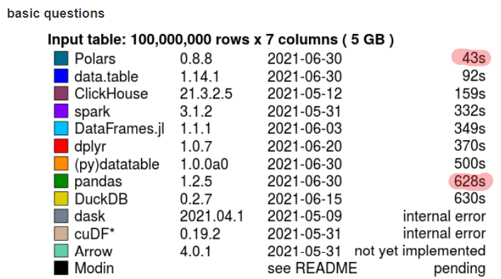
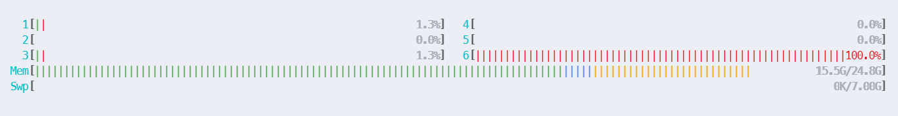
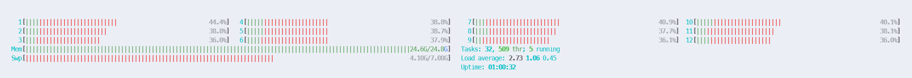
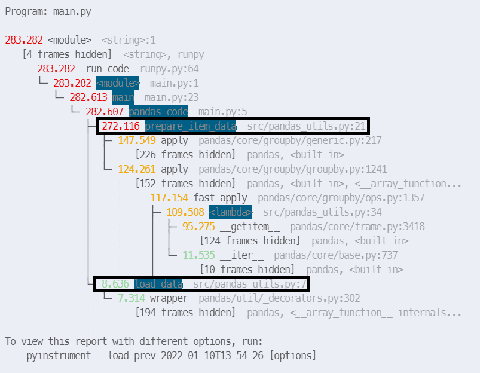
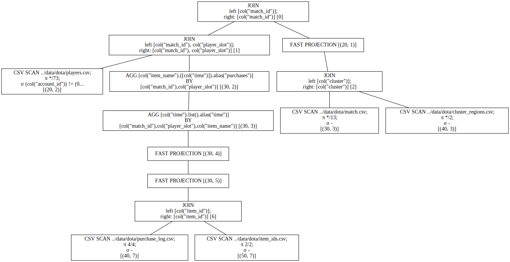

# Polars

## About Polars

- Written in Rust (-> Fast and memory efficient)
- Relies on Arrow for Memory Mapping and column oriented data storage and access
- Offers a Python wrapper (pip installable, everything can be done in python)
- Multi-threaded compared to single-threaded numpy and pandas
- (Semi-) Lazy execution
- Query optimizations (e.g. predicate pushdown, projection pushdown, …)
- Operations run in parallelizable contexts -> each column operation runs in parallel
- Proper NaN dtypes (unlike pandas where pd.NA is float)
- Easy to get started and use (does not require additional components like PySpark or Dask do)
- Distributes the work locally. For very big datasets this might be a limitation

**=> Runs 5x-20x faster than pandas at 50%-75% lower memory consumption**


## Benchmark

[H2O Database-like ops benchmark](https://h2oai.github.io/db-benchmark/)

### Joins



### Groupby


## Data

Dota 2 [Datensatz](https://www.kaggle.com/devinanzelmo/dota-2-matches) von Kaggle im format `.csv`

### Tables used

- `match.csv` (2.6MB) - Information about the played matches (50K matches)

```python
       match_id  start_time  duration  tower_status_radiant   ...
0             0  1446750112      2375                  1982   ...
1             1  1446753078      2582                     0   ...
2             2  1446764586      2716                   256   ...
3             3  1446765723      3085                     4   ...
```

- `cluster_regions.csv` (1KB) - Information about the clusters (geographic regions)

```python
    cluster                region
0       111               US WEST
1       112               US WEST
2       113               US WEST
3       121               US EAST
```

- `purchase_log.csv` (289.8MB) - Informations about bought items (~18Mio transactions)

```python
┌─────────┬──────┬─────────────┬──────────┐
│ item_id ┆ time ┆ player_slot ┆ match_id │
│ ---     ┆ ---  ┆ ---         ┆ ---      │
│ i64     ┆ i64  ┆ i64         ┆ i64      │
╞═════════╪══════╪═════════════╪══════════╡
│ 44      ┆ -81  ┆ 0           ┆ 0        │
├╌╌╌╌╌╌╌╌╌┼╌╌╌╌╌╌┼╌╌╌╌╌╌╌╌╌╌╌╌╌┼╌╌╌╌╌╌╌╌╌╌┤
│ 29      ┆ -63  ┆ 0           ┆ 0        │
├╌╌╌╌╌╌╌╌╌┼╌╌╌╌╌╌┼╌╌╌╌╌╌╌╌╌╌╌╌╌┼╌╌╌╌╌╌╌╌╌╌┤
│ 43      ┆ 6    ┆ 0           ┆ 0        │
└─────────┴──────┴─────────────┴──────────┘
```

- `item_ids.csv` (3KB) - Informations about item names and mappings

```python
     item_id         item_name
0          1             blink
1          2  blades_of_attack
2          3        broadsword
3          4         chainmail
```

- `players.csv` (126.9MB) - Informations about the players (500K entries, 10 for each match)

```python
        match_id  account_id  hero_id  player_slot  gold  gold_spent   ...
0              0           0       86            0  3261       10960   ...
1              0           1       51            1  2954       17760   ...
2              0           0       83            2   110       12195   ...
3              0           2       11            3  1179       22505   ...
```

*Anonymous users have the value of 0 for account_id*

## Operations

Compare polars and pandas using a set of typical operations (read data, join, groupby, filter, select, ...)

```python
# API in some cases equal/similar to pandas
pl_match = pl.read_csv(f"{DATA_DIR}/match.csv")

match_with_region = pl_match.join(pl_cluster_regions, how="left", on="cluster").drop(
    "cluster"
)

purchases_with_item_names = (
    pl_purchase_log.join(pl_item_id_names, how="left", on="item_id")
    .drop("item_id")
    .groupby(["match_id", "player_slot", "item_name"])
    # In other cases close to pyspark
    .agg(pl.col("time").list().keep_name())
)

purchases_with_item_names.head()
```

TODO: Explain polars API by copying snippets into markdown + comments

## Results and performance

### Pandas CPU / Memory usage



### Polars CPU / Memory usage



## Code execution time

<div style="display: grid; grid-template-areas: 'a b' 'c d';">
  <h3 style="grid-area: a;">Pandas execution time (10% of the data)</h3>
  

  <h3 style="grid-area: b;">Polars execution time (100% of the data)</h3>
  
</div>

## Query plan

<div style="display: grid;">
  
  </br>
  <p>σ -> predicate pushdown (filter etc. on scan level)</p>
  <p>π -> projection pushdown (column selection on scan level)</p>
  
</div>
